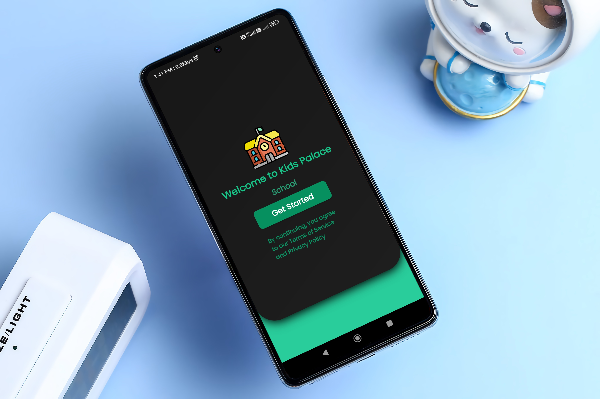
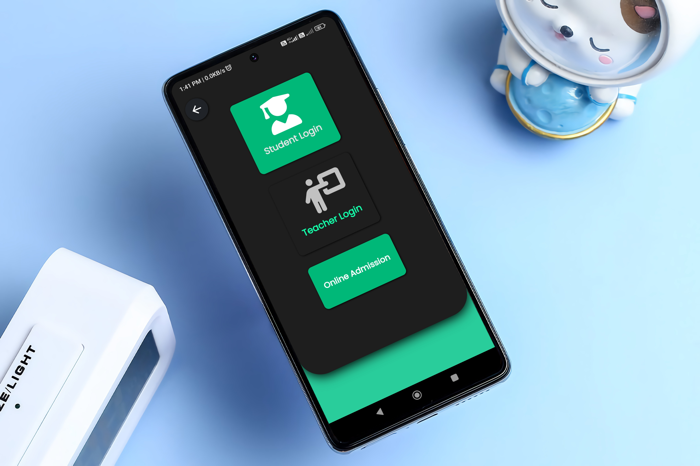
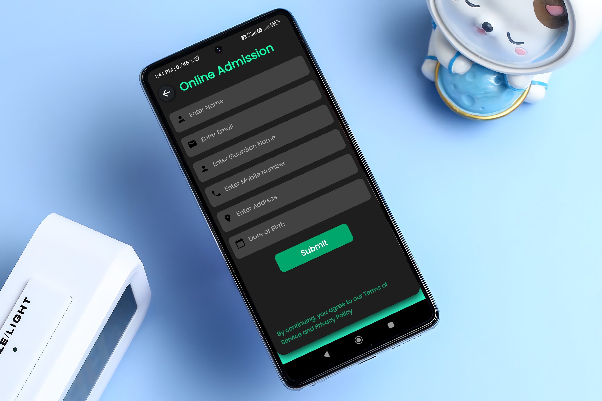
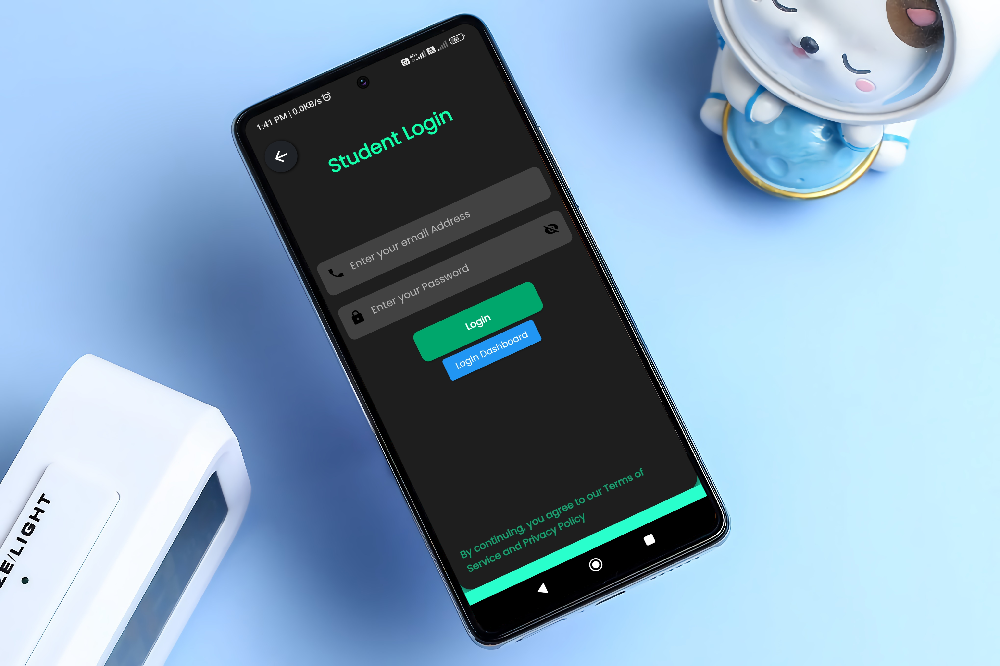
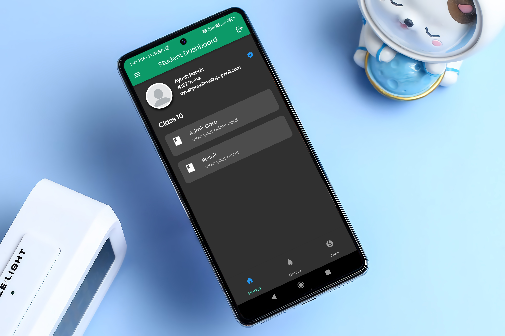

# 
 Kids Palace School

#

## Screenshots

#

## Features

1. Save your documents offline, so that you can access it even if you are offline.
2. Login with your School Email and Password
3. In-App updates, get notified about new versions, and update without leaving the app
4. Simple UI

<!-- ## Screenshots

 -->

#

## Tech Used

- App - Flutter
- Server - Supabase

## Packages Used

- cached_network_image
- flutter_full_pdf_viewer
- font_awesome_flutter
- http
- in_app_update
- package_info
- path_provider
- share
- share_extend
- shared_preferences
- url_launchers
